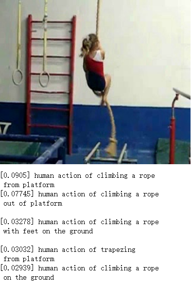
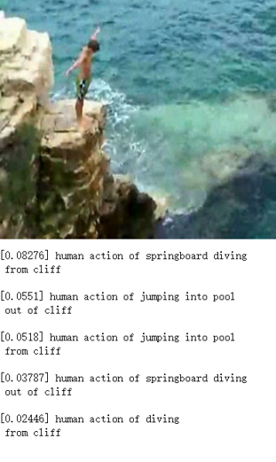
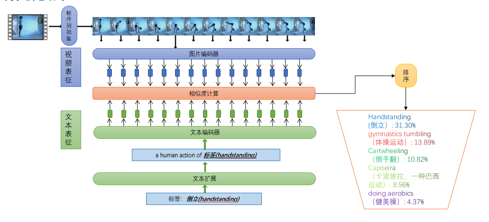

# Action-recognization-with-CLIP
用CLIP进行动作识别






## 工作原理

OpenAI's [CLIP](https://openai.com/blog/clip/) 模型能够对图像内容进行零样本学习并识别其内容，使得我们在不经过重新训练的前提下依然能够很好的完成所需的任务。



## 如何运行整个项目

### 环境安装
运行代码前，请确定你已经安装如下所需环境：

```
pip install -r requirements.txt
```

除此之外，你还需要安装Jupyter Notebook。

### 运行步骤

- 运行`setup-clip.ipynb` - 安装CLIP模型和相关环境
- 运行`extract frames.ipynb` - 对待处理视频进行帧抽取，得到帧序列
- 运行`text_process.ipynb` - 处理和嵌入动作文本，得到特征信息并保存
- 运行`Action Recognize.ipynb` - 利用上述文件对视频进行动作识别，得到每帧对应预测结果

> 注：如果你只想查看运行结果，可以直接运行Action Recognize.ipynb。

## 致谢
这个项目受到项目[natural-language-image-search](https://github.com/haltakov/natural-language-image-search) by [haltakov] 的启发。


## 联系方式

1273795523@qq.com
